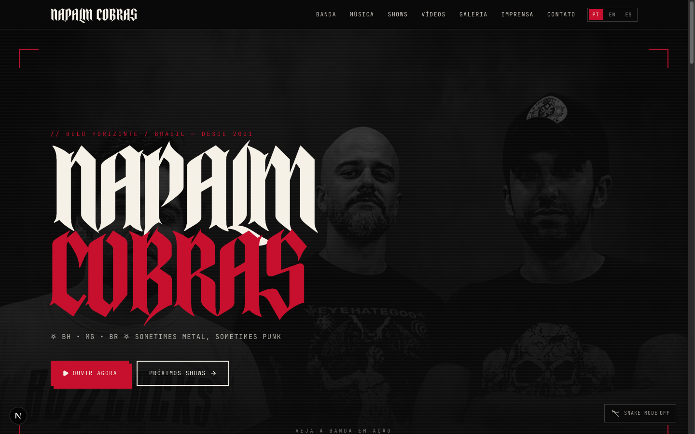

# Napalm Cobras

[](https://nextjs.org/)
[](https://react.dev/)
[](https://www.typescriptlang.org/)
[](https://tailwindcss.com/)
[](https://www.framer.com/motion/)
[](https://biomejs.dev/)
[](https://pnpm.io/)
[](https://www.napalmcobras.com)

Official website of **Napalm Cobras** — Metalpunk from Belo Horizonte / MG, Brazil.

Built with **Next.js 16 (App Router)**, **React 19**, strict **TypeScript**, **Tailwind CSS v4**, **Framer Motion** and **Biome**. Internationalized by URL (`/pt`, `/en`, `/es`) with static rendering (SSG/ISR) for maximum performance and SEO.

- Production: <https://www.napalmcobras.com>



## Table of contents

- [Stack](#stack)
- [Requirements](#requirements)
- [Getting started](#getting-started)
- [Scripts](#scripts)
- [Environment variables](#environment-variables)
- [Architecture](#architecture)
- [Project structure](#project-structure)
- [Routes & pages](#routes--pages)
- [Internationalization](#internationalization)
- [Integrations (Tier 1 / Tier 2)](#integrations-tier-1--tier-2)
- [Content & configuration](#content--configuration)
- [Homepage & Snake Mode](#homepage--snake-mode)
- [SEO](#seo)
- [Deployment](#deployment)

## Stack

- **Next.js 16** — App Router, SSG/ISR, `next/image`, `next/font`, `next/script`
- **React 19** + **TypeScript 5.8** (strict mode)
- **Tailwind CSS v4** (`@tailwindcss/postcss`) + CSS Modules
- **Framer Motion** — animations (`Reveal` component, home "rooms", snake trail, page transitions)
- **clsx** + **tailwind-merge** — class name composition (`mergeClassNames`)
- **react-icons** / **lucide-react** — icons (incl. brand icons for streaming services)
- **Biome** — linting and formatting (replaces ESLint + Prettier)
- **Husky** — git hooks (pre-commit runs Biome)
- **pnpm** — package manager
- **Vercel** — deployment, **Analytics** and **Speed Insights**

## Requirements

- **Node.js** 20+ (LTS recommended)
- **pnpm** 9+ (`corepack enable` activates pnpm automatically)

## Getting started

```bash
# 1. Install dependencies
pnpm install

# 2. Configure environment variables
cp .env.example .env
# edit .env following the "Environment variables" section

# 3. Start the dev server
pnpm dev
# http://localhost:3000  (redirects to the detected locale, e.g. /pt)
```

## Scripts

```bash
pnpm dev      # development server
pnpm build    # production build (SSG/ISR)
pnpm start    # serve the production build
pnpm lint     # Biome check (lint + format, no writes)
pnpm format   # Biome check --write (formats and organizes imports)
```

## Environment variables

Every integration works **without credentials** (Tier 1, via embeds/links) and unlocks dynamic data once the variables below are provided (Tier 2). Use `.env.example` as a starting point.

| Variable | Required | Description |
| --- | --- | --- |
| `NEXT_PUBLIC_SITE_URL` | Yes | Canonical URL used in metadata, Open Graph, sitemap and robots. |
| `NEXT_PUBLIC_BANDSINTOWN_APP_ID` | No | Public Bandsintown App ID. Enables the native schedule + `MusicEvent` JSON-LD. |
| `SPOTIFY_CLIENT_ID` | No | Spotify Web API (Client Credentials) — album/artist data. |
| `SPOTIFY_CLIENT_SECRET` | No | Spotify Web API secret. **Never commit it.** |
| `BEHOLD_FEED_ID` | No | [Behold.so](https://behold.so) feed ID for the Instagram grid. |

> The `.env` file (with real secrets) is in `.gitignore` and must not be versioned. In production, configure the variables in the Vercel dashboard.

## Architecture

Components follow the **Single Responsibility Principle (SRP)** with a three-file co-located pattern:

- **`Component.tsx`** — structure only (JSX/markup). Reads data and handlers from its hook.
- **`Component.module.css`** — styling (Tailwind via `@apply` + CSS Modules).
- **`Component.hooks.ts`** — logic and encapsulation: state, effects, refs, derived values, motion values and handlers (e.g. `useHomeView`, `useSnakeTrail`, `useFlyerLightbox`, `useSiteNavigation`).

Each component folder also exposes a barrel (`index.ts`) for clean imports. The entire `src/` tree is documented with **TSDoc** (English), including module overviews, components, hooks, services, types and configuration.

## Project structure

```
src/
  app/                     # routing (App Router)
    [locale]/(site)/       # localized pages + layout, template, error
      band | music | shows | videos | gallery | press | contact
      page.tsx             # home
    layout.tsx             # root (metadata, fonts, globals, providers)
    not-found.tsx
    sitemap.ts | robots.ts
  components/
    layout/                # Header (+ Header.hooks), Footer
    sections/              # animated/structural blocks, each as
                           #   .tsx + .module.css (+ .hooks.ts when stateful):
                           #   AudioPlayer, CaveRoom, FlyerGallery, GlitchText,
                           #   LinkGrid, LinkedText, Marquee, Reveal,
                           #   SnakeToggle, SnakeTrail
    templates/             # page views (HomeView + HomeView.hooks,
                           #   NotFoundView, SectionTitle/PageHero)
    seo/                   # JsonLd
  config/                  # site.ts, navigation.ts, flyers.ts, clipping.ts
  contexts/                # i18n-context (per-locale dictionary)
  features/                # domain integrations:
    shows/                 #   Bandsintown
    music/                 #   Spotify Web API + embeds
    instagram/ social/     #   Instagram feed/follow (Behold.so)
  i18n/                    # config + pt/en/es dictionaries
  lib/                     # seo, fonts, utils, api/http, social-icons
  providers/               # AppProviders
  styles/                  # globals.css, primitives.module.css
  types/                   # shared types
  proxy.ts                 # locale detection & redirect (Next.js 16)
public/assets/             # images (members, flyers, hero) and svgs
```

## Routes & pages

Every route is locale-prefixed (`/[locale]/...`). The menu is defined in `src/config/navigation.ts`.

| Route | Page | Content |
| --- | --- | --- |
| `/[locale]` | Home | Hero + animated "rooms" (Studio, Stage, Tour, Feed), Snake Mode. |
| `/[locale]/band` | Band | Biography, members and timeline (with inline links via `LinkedText`). |
| `/[locale]/music` | Music | Featured releases, players (Spotify), credits and streaming links. |
| `/[locale]/shows` | Shows | Schedule (Bandsintown) and booking. |
| `/[locale]/videos` | Videos | Live show, clips and recordings. |
| `/[locale]/gallery` | Gallery | Show flyers (`config/flyers.ts`) with lightbox. |
| `/[locale]/press` | Press | Press release, rider, stage plot and Clipping (`config/clipping.ts`). |
| `/[locale]/contact` | Contact | Booking, e-mail and a grid of social/streaming links (`LinkGrid`). |

## Internationalization

- Locales: `pt` (default), `en`, `es`.
- `proxy.ts` (the former `middleware` convention, renamed in Next.js 16) detects the language (cookie / `Accept-Language`) and redirects `/` to the appropriate locale.
- Dictionaries live in `src/i18n/{pt,en,es}.ts` and are **typed from `pt`** via the `Lang` type — adding a key in `pt` makes translating it in `en` and `es` mandatory (compile error otherwise).

## Integrations (Tier 1 / Tier 2)

- **Bandsintown** (`features/shows`): official widget by default; native schedule + `MusicEvent` JSON-LD when `NEXT_PUBLIC_BANDSINTOWN_APP_ID` is set.
- **Spotify** (`features/music`): embedded players always; album/artist metadata via the Web API when `SPOTIFY_CLIENT_ID`/`SPOTIFY_CLIENT_SECRET` are set (falls back to a curated release list).
- **Bandcamp**: embedded players.
- **Instagram** (`features/instagram` / `features/social`): "follow" block by default; feed grid when `BEHOLD_FEED_ID` is set (Behold.so).

## Content & configuration

Most content is editable in typed configuration files, without touching components:

- `src/config/site.ts` — core band data: socials, streaming services, album/EP, members, press, release credits (`RELEASE_CREDITS`) and the inline link list (`BAND_LINKS`) used by `LinkedText` on `/band`.
- `src/config/flyers.ts` — gallery flyers (`{ src, title, year, venue, lineup }`).
- `src/config/clipping.ts` — press/news items for the Clipping section on `/press`.
- `src/config/navigation.ts` — menu items.
- `src/i18n/{pt,en,es}.ts` — all copy (including the band bio and timeline).

### Adding flyers to the gallery

1. Drop the images in `public/assets/images/flyers/`.
2. Append the item to the `FLYERS` array in `src/config/flyers.ts`.

## Homepage & Snake Mode

The home page is organized into animated "rooms" (Studio, Stage, Tour, Feed) powered by `framer-motion`. **Snake Mode** is a cobra trail that slithers down the page as you scroll.

- The site **starts with Snake Mode OFF** by default.
- The preference is persisted in `localStorage` (`SNAKE_STORAGE_KEY`): the trail only appears automatically if the visitor enabled it before.
- Users toggle it via the `SnakeToggle` button (home corner). The trail is rendered through a React portal into the page root so it spans the full scroll height.

## SEO

- Per-page, per-locale metadata (titles, descriptions, Open Graph) via `lib/seo`.
- `app/sitemap.ts` and `app/robots.ts` generated from `NEXT_PUBLIC_SITE_URL`.
- Structured JSON-LD data (`components/seo/JsonLd`) — e.g. `MusicGroup` and `MusicEvent`.
- Images optimized with `next/image`; fonts with `next/font`.

## Deployment

Optimized for **Vercel**. Configure the `.env.example` variables in the project dashboard — especially `NEXT_PUBLIC_SITE_URL`, which sets the canonical URL used in metadata, sitemap and robots. `@vercel/analytics` and `@vercel/speed-insights` are already integrated.
